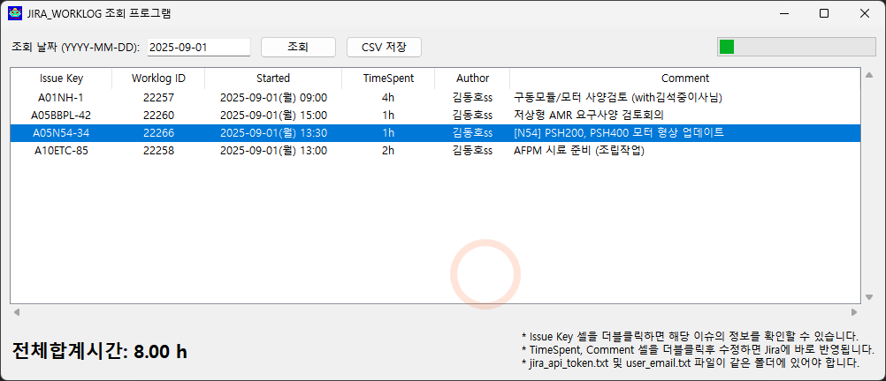

# 개요



# 실행 조건
* 파이썬 패키지 관리자 uv가 설치되어 있을 것

## uv 설치 방법
* scoop를 이용하여 설치 (유저권한, 권장, scoop 패키지 관리자를 사용하는 경우)
```
scoop install uv
```

* winget을 이용하여 설치 (유저권한, 권장, MS-Windows 11 사용하는 경우)
```
winget install --id=astral-sh.uv -e
```

* 정규 배포판으로 설치 방법 (관리자권한)
```
# Powershell을 관리자 권한으로 실행한 후, 아래 명령어 입력해서 실행
powershell -ExecutionPolicy ByPass -c "irm https://astral.sh/uv/install.ps1 | iex"
```


# 사용방법

## jira_api_token 만들기 (최초1회)
* Jira 브라우저 페이지 오른쪽 상단의 자신의 아이디 아이콘을 누른다.
* `Manage acount`를 누른다.
* 상단의 `Security`를 누른다.
* `Create and manage API tokens`를 누른다.
* `Create API token`을 누른다.
* `Name`을 적당하게 적어주고, `Expired on`은 충분히 오랜 날짜로 설정해 준다.
* `Create`를 눌러준다.
* 생성된 API token을 복사해서, 잘 보관해 둔다.  두 번 다시 보여주지 않기 때문에 분실할 경우 새로 생성해야 한다.

## 실행아이콘 만들기 (최초1회)
* `JIRA_WORKLOG.bat` 파일의 바로가기 만들기
* 바로가기 아이콘을 원하는 위치에 배치해 두고 사용
* 바로가기 아이콘 설정에서, 'robot_1211_V01.ico' 파일을 지정해서 예쁜 아이콘으로 변경 가능함

## UV 가상환경 체크하기 (최초1회)
* `./JIRA_WORKLOG` 폴더에서 터미널 열기
* `uv venv` 명령 입력 (가상환경 초기화)

## 최초 실행
* `JIRA_WORKLOG.bat` 파일 더블클릭해서 실행

### 'Jira Member Adder' 팝업창이 뜨면, 
* jira_api_token 및 jira_api_email 입력칸을 채워준다.
* `Search User by Email` 항목에 조회하고자 하는 사용자의 이메일 입력
* `Search` 버튼을 눌러서 해당 이메일의 사용자 정보 확인
* `Add to members.csv` 버튼을 눌러서 추가 등록
* 반복적으로 여러 사용자를 등록 가능함
* `EXIT` 버튼으로 팝업창 종료

## 사용하기
* `JIRA_WORKLOG.bat` 파일 더블클릭해서 실행
* Worklog 기록된 시간을 알고싶은 날짜를 입력하고 실행버튼 클릭하면 됨
* 맨 마지막 업무시간이 전체 합산 시간임
* Issue Key 셀을 더블클릭하면 팝업창으로 해당 이슈 정보 확인 가능
* TimeSpent, Comment 셀은 더블클릭해서 수정하면 Jira에도 바로 반영됨

## 주의사항
* 자신이 아닌 다른 사람의 업무로그를 함부로 수정하지 말 것 (민폐조심)
