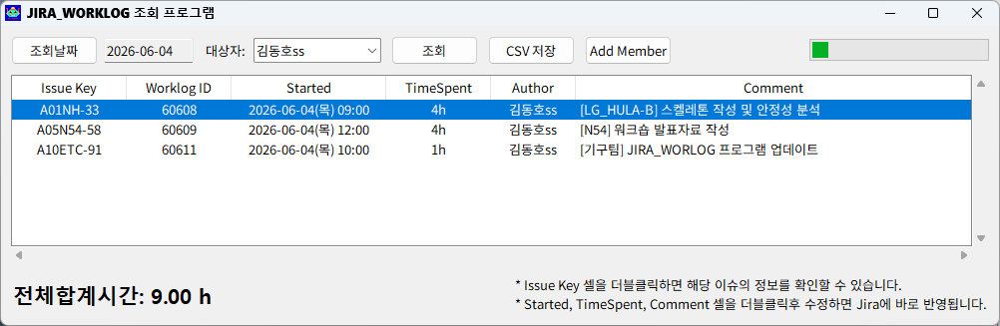

# 🛠️ Jira Worklog & Confluence Weekly 관리 도구

Jira의 업무 로그(Worklog)를 간편하게 조회 및 수정하고, Confluence의 주간 업무 블로그 게시글을 깔끔한 Markdown 파일로 내보낼 수 있는 데스크톱 유틸리티 패키지입니다.



---

## 📌 주요 기능

### 1. Jira 업무 로그(Worklog) 관리 (`main.py` / `JIRA_WORKLOG.bat`)
* **업무 로그 일괄 조회**: 날짜와 대상자를 선택해 간편하게 하루 업무 로그를 한눈에 확인합니다.
* **합계 시간 계산 및 경고**: 하루 총 입력 시간이 **9.0시간**(근무 8시간 + 점심 1시간 기준 등)이 아닐 경우 합계 시간이 빨간색으로 표시되어 기입 누락이나 초과 여부를 쉽게 인지할 수 있습니다.
* **실시간 원격 수정 (더블클릭)**:
  * **Started (작업시작일시)**: 달력 및 시간 선택 팝업을 통해 직관적으로 시작 일시를 변경합니다.
  * **TimeSpent (소요시간)**: 셀을 더블클릭하여 시간을 수정하면 Jira에 실시간 적용됩니다 (예: `2h`, `30m`).
  * **Comment (내용)**: 업무 내용을 즉시 수정할 수 있습니다.
* **이슈 상세 정보 조회**: **Issue Key** 셀을 더블클릭하면 팝업창으로 해당 Jira 이슈의 제목, 상태, 담당자, 설명 등을 바로 확인합니다.
* **중복 로그 강조**: 시작 시간이 동일하여 중복 기입된 로그는 빨간색으로 표시되어 실수를 방지합니다.
* **CSV 내보내기**: 조회된 결과를 언제든지 CSV 파일로 저장할 수 있습니다.

### 2. 주간업무일지 초안 작성하기 (Confluence 블로그 내용을 읽어서 재작성) (`weekly.py` / `weekly.bat`)
* **Space 별 블로그 조회**: Confluence의 Space 목록을 불러와 등록된 블로그 게시물(주간 보고 등)을 가져옵니다.
* **Markdown 변환**: HTML 기반의 Confluence 포맷을 깔끔한 마크다운(`.md`) 파일로 정제하여 `weekly/output/` 폴더에 저장합니다.
* **업무 템플릿 최적화**: 테이블 내의 줄바꿈 처리, 프로젝트 식별자(`[프로젝트명]`) 자동 접두사 삽입, 현황/담당자 정보 병합 등 가독성 높은 표 형식으로 자동 정렬됩니다.

---

## ⚙️ 최초 실행 환경 설정

프로그램을 처음 사용할 때만 거쳐야 하는 초기 설정 과정입니다.

### 1. Jira API 토큰 발급 받기
Jira 서버와 연동하기 위해 개인 API 토큰이 필요합니다.
1. Jira 브라우저 페이지 우측 상단의 **프로필 아이콘** 클릭 ➡️ **Manage account (계정 관리)** 선택
2. 상단 메뉴의 **Security (보안)** 탭 클릭
3. **Create and manage API tokens** 클릭 ➡️ **Create API token** 버튼 클릭
4. 구분하기 쉬운 Label명(예: `worklog-tool`)을 입력하고 **Create** 클릭
5. **생성된 토큰을 복사하여 안전한 곳에 보관합니다.** (최초 노출 이후 다시 확인할 수 없습니다.)

### 2. Python 패키지 관리자 `uv` 설치
이 프로그램은 빠르고 안정적인 패키지 실행을 위해 `uv`를 사용합니다. 컴퓨터 환경에 맞는 명령어를 터미널(PowerShell 등)에 입력해 설치하세요.

> [!TIP]
> Windows 11 사용자는 **winget** 방식을 가장 권장합니다.

* **Windows 11 기본 패키지 관리자 사용 (권장)**:
  ```powershell
  winget install --id=astral-sh.uv -e
  ```
* **Scoop 패키지 관리자 사용 시**:
  ```powershell
  scoop install uv
  ```


### 3. 가상환경 구성하기
프로그램이 있는 폴더에서 터미널을 열고 아래 명령어를 실행하여 가상환경을 초기화합니다.
```powershell
uv venv
```

---

## 🚀 사용 방법

### Step 1: 최초 실행 및 인증/사용자 등록
1. **`JIRA_WORKLOG.bat`** 파일을 더블클릭하여 실행합니다.
2. 최초 실행 시 인증 정보나 사용자가 없으면 **Jira Member Adder** 팝업창이 자동으로 뜹니다.
   * **Jira API Token**: 위에서 발급받은 API 토큰을 입력합니다.
   * **jira_api_email**: 본인의 Jira 계정 이메일 주소를 입력합니다.
   * **Search User by Email**: 조회 및 등록하고 싶은 팀원의 이메일을 입력하고 **Add User**를 클릭합니다.
   * 본인을 포함해 관리가 필요한 팀원들을 차례대로 검색해 등록해 줍니다. (등록된 정보는 `members.csv`에 저장됩니다.)
3. 등록 완료 후 **EXIT** 버튼을 누르면 메인 화면으로 돌아옵니다.

### Step 2: 업무 로그 조회 및 수정하기
1. **대상자 선택**: 상단의 `대상자` 드롭다운에서 조회할 인원을 선택합니다.
2. **조회 날짜 선택**: `조회날짜` 버튼을 클릭해 달력에서 날짜를 지정합니다 (기본값: 오늘).
3. **조회**: `조회` 버튼을 누르면 해당 날짜의 업무 로그 목록이 나타납니다.
4. **수정 및 편집**:
   * **Started / TimeSpent / Comment** 셀을 더블클릭하여 수정 후 Enter를 누르면 Jira 서버에 즉시 동기화됩니다.
   * **Issue Key** 셀을 더블클릭하면 상세 내용을 바로 읽을 수 있는 팝업이 표시됩니다.
5. **결과 저장**: `CSV 저장` 버튼으로 현재 표에 표시된 데이터를 파일로 보관할 수 있습니다.
6. **멤버 추가**: 팀원이 늘어난 경우 `Add Member` 버튼을 눌러 언제든 추가 등록할 수 있습니다.

### Step 3: Confluence 주간 업무 가져오기 (Confluence Exporter)
1. **`weekly.bat`** 파일을 더블클릭하여 실행합니다.
2. 상단 드롭다운에서 원하는 **Space**를 선택합니다 (기본값: 기구팀 space).
3. 하단 표에 해당 Space의 블로그 게시물 목록이 최신순으로 나열됩니다.
4. 내보낼 글을 마우스로 선택(Shift/Ctrl 다중 선택 가능)한 뒤 **선택 블로그 MD로 저장** 또는 **전체 블로그 MD로 저장** 버튼을 누릅니다.
5. **`weekly/output/`** 폴더에 깔끔하게 정제된 마크다운(`.md`) 파일들이 저장된 것을 확인합니다.

---

## 📂 주요 파일 구성 안내

| 파일 / 폴더명 | 구분 | 설명 |
| :--- | :--- | :--- |
| `JIRA_WORKLOG.bat` | 실행 파일 | 메인 Jira 업무 로그 관리 프로그램 실행 |
| `add_member.bat` | 실행 파일 | Jira API 토큰/이메일 설정 및 멤버 등록 프로그램 실행 |
| `weekly.bat` | 실행 파일 | Confluence 블로그 가져오기 프로그램 실행 |
| `main.py` | 소스 코드 | 업무 로그 조회/수정 GUI 코어 코드 |
| `add_member.py` | 소스 코드 | 사용자 추가 및 인증 정보 설정 GUI 코드 |
| `weekly/weekly.py` | 소스 코드 | Confluence 블로그 조회 및 MD 변환기 소스 |
| `members.csv` | 데이터 | 이름, Jira AccountID, 이메일 매핑 데이터 저장 파일 |
| `jira_api_token.txt` | 보안 | 발급받은 Jira API Token이 암호화 없이 텍스트로 보관되는 파일 (외부 유출 주의) |
| `jira_api_email.txt` | 인증 | 인증용 사용자의 이메일 주소가 저장되는 파일 |
| `weekly/output/` | 폴더 | Confluence에서 내보낸 Markdown 파일들이 저장되는 곳 |

---

## ⚠️ 주의사항

> [!WARNING]
> * **보안 주의**: `jira_api_token.txt` 파일에는 사용자의 Jira API 토큰이 평문으로 저장됩니다. 이 파일이 Git이나 공용 저장소 등에 노출되지 않도록 각별히 주의해 주세요 (기본적으로 `.gitignore`에 등록되어 있습니다).
> * **로그 수정 주의**: 타인의 업무 로그를 더블클릭하여 수정할 경우에도 실제 Jira 서버에 실시간으로 반영됩니다. 협업 중 오작동이나 혼선을 피하기 위해 가급적 **자신의 업무 로그 위주로만 수정**하는 것을 권장합니다.
