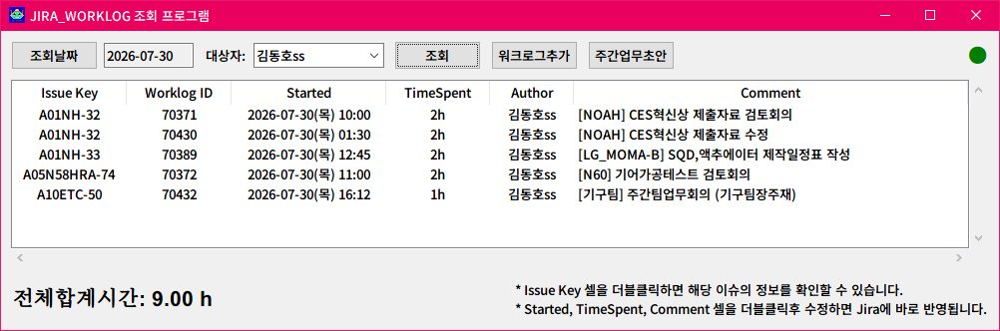

# 🛠️ Jira Worklog & Confluence Weekly 관리 도구

Jira의 업무 로그(Worklog)를 간편하게 조회·수정·등록하고, **주간업무초안 엑셀 보고서를 자동 생성**하며, Confluence의 주간 업무 블로그 게시글을 깔끔한 Markdown 파일로 내보낼 수 있는 데스크톱 유틸리티 패키지입니다.



---

## 📌 주요 기능

### 1. Jira 업무 로그(Worklog) 관리 (`main.py` / `JIRA_WORKLOG.bat`)
* **Jira 전체 사용자 자동 로드**: Jira REST API를 통해 등록된 전체 사용자 목록을 약 1초 만에 자동으로 수집하며, 현재 로그인된 내 계정이 기본 선택됩니다.
* **업무 로그 일괄 조회**: 날짜와 대상자를 선택해 하루 업무 로그를 한눈에 확인합니다.
* **합계 시간 계산 및 경고**: 하루 총 입력 시간이 **8.00 ~ 9.00시간**(근무 8시간 ~ 점심 1시간 포함 9시간 기준 등) 범위 내에 있지 않을 경우 합계 시간이 빨간색으로 표시됩니다.
* **실시간 원격 수정 (더블클릭)**:
  * **Started (작업시작일시)**: 달력 및 시간 선택 팝업을 통해 직관적으로 시작 일시를 변경합니다.
  * **TimeSpent (소요시간)**: 셀을 더블클릭하여 시간을 수정하면 Jira에 실시간 적용됩니다 (예: `2h`, `30m`).
  * **Comment (내용)**: 업무 내용을 즉시 수정할 수 있습니다.
* **워크로그 추가**: `워크로그추가` 버튼을 통해 특정 Space(`[A10ETC]` 기본 선택) 및 Column(`In Progress` 기본 선택)의 Work Item에 대한 신규 업무 로그를 간편하게 등록할 수 있습니다. (준비 중 시 오른쪽 인디케이터가 빨간색으로 표시됩니다.)
* **이슈 상세 정보 조회**: **Issue Key** 셀을 더블클릭하면 팝업창으로 해당 Jira 이슈의 제목, 상태, 담당자, 설명 등을 시스템 기본 폰트로 바로 확인합니다.
* **중복 로그 강조**: 시작 시간이 동일하여 중복 기입된 로그는 빨간색으로 표시되어 실수를 방지합니다.

### 2. 주간업무초안 엑셀 보고서 자동 생성 (`main.py` - `주간업무초안`)
* **2주간 Worklog 자동 집계**: 선택한 "조회 날짜"를 기준으로 해당 날짜가 속한 주(월~일, `금주`) 및 그 다음 주(월~일, `다음주`) 총 2주일간의 업무 로그를 자동으로 수집합니다.
* **엑셀 자동 정렬 및 서식 구성**:
  * **컬럼 구성**: `주차` | `업무내용` | `작업날짜` | `작성자`
  * **작업날짜 형식**: `mm/dd 완료` (금주) 또는 `mm/dd 목표` (다음주) 형태로 표시됩니다.
  * **정렬 규칙**: 업무내용(가나다/알파벳) 순서대로 정렬됩니다.
  * **자동 너비 조절**: 텍스트 길이에 맞춰 컬럼 폭이 자동으로 확장되어 자림 없이 깔끔하게 보여집니다.
* **파일 자동 저장 및 즉시 열기**: `output/<조회날짜>.xlsx` 파일로 저장되며, 생성 직후 엑셀 프로그램이 자동으로 호출되어 보고서를 보여줍니다.

### 3. Confluence 주간 업무 가져오기 (`weekly.py` / `weekly.bat`)
* **Space 별 블로그 조회**: Confluence의 Space 목록을 불러와 등록된 블로그 게시물(주간 보고 등)을 가져옵니다.
* **Markdown 변환**: HTML 기반의 Confluence 포맷을 깔끔한 마크다운(`.md`) 파일로 정제하여 `weekly/output/` 폴더에 저장합니다.

---

## ⚙️ 최초 실행 환경 설정

프로그램을 처음 사용할 때만 거쳐야 하는 초기 설정 과정입니다.

### 1. Jira API 토큰 발급 받기
Jira 서버와 연동하기 위해 개인 API 토큰이 필요합니다.
1. Jira 브라우저 페이지 우측 상단의 **프로필 아이콘** 클릭 ➡️ **Manage account (계정 관리)** 선택
2. 상단 메뉴의 **Security (보안)** 탭 클릭
3. **Create and manage API tokens** 클릭 ➡️ **Create API token** 버튼 클릭
4. 구분하기 쉬운 Label명(예: `worklog-tool`)을 입력하고 **Create** 클릭
5. **생성된 토큰을 복사하여 안전한 곳에 보관합니다.** (최초 노출 이후 다시 확인할 수 없습니다.)

### 2. Python 패키지 관리자 `uv` 설치
이 프로그램은 빠르고 안정적인 패키지 실행을 위해 `uv`를 사용합니다.
* **Windows 11 기본 패키지 관리자 사용 (권장)**:
  ```powershell
  winget install --id=astral-sh.uv -e
  ```
* **Scoop 패키지 관리자 사용 시**:
  ```powershell
  scoop install uv
  ```

### 3. 가상환경 구성하기
프로그램이 있는 폴더에서 터미널을 열고 아래 명령어를 실행하여 가상환경을 초기화합니다.
```powershell
uv venv
uv sync
```

---

## 🚀 사용 방법

### Step 1: 최초 실행 및 인증 설정
1. **`JIRA_WORKLOG.bat`** 파일을 더블클릭하여 실행합니다.
2. 최초 실행 시 인증 정보가 없거나 유효하지 않으면 **`Jira Member Adder`** 설정 팝업창이 자동으로 뜹니다.
   * **Jira API Email**: 본인의 Jira 계정 이메일 주소를 입력합니다.
   * **Jira API Token**: 발급받은 API 토큰을 입력합니다.
   * **[저장 및 연결]** 버튼을 누르면 연동 검증 후 인증 파일(`jira_api_email.txt`, `jira_api_token.txt`)이 생성되고 메인 화면으로 이동합니다.

### Step 2: 업무 로그 조회 및 수정하기
1. **대상자 선택**: 상단의 `대상자` 드롭다운에서 조회할 인원을 선택합니다 (로그인된 내 계정이 기본 선택됩니다).
2. **조회 날짜 선택**: `조회날짜` 버튼을 클릭해 달력에서 날짜를 지정합니다 (기본값: 오늘).
3. **조회**: `조회` 버튼을 누르면 해당 날짜의 업무 로그 목록이 나타납니다.
4. **수정 및 편집**: **Started / TimeSpent / Comment** 셀을 더블클릭하여 수정 후 Enter를 누르면 Jira 서버에 즉시 동기화됩니다.
5. **워크로그 추가**: `워크로그추가` 버튼을 눌러 특정 이슈에 대한 신규 업무 로그를 기록합니다.

### Step 3: 주간업무초안 엑셀 생성하기
1. 상단에서 기준이 되는 `조회날짜`를 선택합니다.
2. `주간업무초안` 버튼을 누르면 2주간(금주/다음주)의 업무 로그가 자동으로 집계되어 `output/<조회날짜>.xlsx` 엑셀 파일이 생성되고 즉시 엑셀 프로그램으로 열립니다.

### Step 4: Confluence 주간 업무 가져오기 (Confluence Exporter)
1. 메인 GUI 상단의 **`Weekly`** 버튼을 누르거나, **`weekly.bat`** 파일을 더블클릭하여 실행합니다.
2. 상단 드롭다운에서 원하는 **Space**를 선택하고, 목록에서 블로그 게시물을 선택 후 MD 파일로 내보냅니다.

---

## 📂 주요 파일 구성 안내

| 파일 / 폴더명 | 구분 | 설명 |
| :--- | :--- | :--- |
| `JIRA_WORKLOG.bat` | 실행 파일 | 메인 Jira 업무 로그 관리 및 주간업무초안 작성 프로그램 실행 |
| `weekly.bat` | 실행 파일 | Confluence 블로그 가져오기 프로그램 실행 |
| `main.py` | 소스 코드 | 업무 로그 조회/수정/등록, 주간업무초안 엑셀 생성 및 최초 인증(`Jira Member Adder`) 설정 통합 GUI 코어 코드 |
| `weekly/weekly.py` | 소스 코드 | Confluence 블로그 조회 및 MD 변환기 소스 |
| `jira_api_token.txt` | 보안 | 발급받은 Jira API Token 저장 파일 (외부 유출 주의) |
| `jira_api_email.txt` | 인증 | 인증용 사용자의 이메일 주소 저장 파일 |
| `output/` | 폴더 | 주간업무초안 엑셀 파일(`output/<조회날짜>.xlsx`)이 생성 저장되는 곳 |
| `weekly/output/` | 폴더 | Confluence에서 내보낸 Markdown 파일들이 저장되는 곳 |

---

## ⚠️ 주의사항

> [!WARNING]
> * **보안 주의**: `jira_api_token.txt` 파일에는 사용자의 Jira API 토큰이 평문으로 저장됩니다. 이 파일이 Git이나 공용 저장소 등에 노출되지 않도록 각별히 주의해 주세요 (`.gitignore`에 기본 등록되어 있습니다).
> * **로그 수정 주의**: 타인의 업무 로그를 더블클릭하여 수정할 경우에도 실제 Jira 서버에 실시간으로 반영됩니다. 가급적 **자신의 업무 로그 위주로만 수정**하는 것을 권장합니다.
